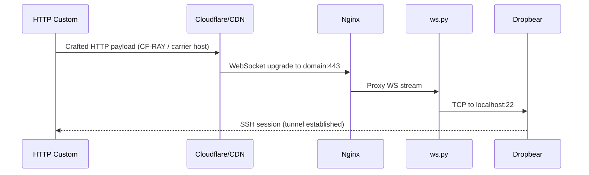

# VPN Script — Technical Architecture & Functionality

Deep dive into how [stanlley-locke/vpn_script](https://github.com/stanlley-locke/vpn_script) works: stack layout, traffic flow, modules, and extension points.

---

## Table of contents

1. [Design goals](#1-design-goals)
2. [High-level architecture](#2-high-level-architecture)
3. [Traffic flow](#3-traffic-flow)
4. [Component reference](#4-component-reference)
5. [Xray configuration](#5-xray-configuration)
6. [REALITY inbound](#6-reality-inbound)
7. [Subscription server](#7-subscription-server)
8. [Cloudflare integration](#8-cloudflare-integration)
9. [Cloudflare Tunnel](#9-cloudflare-tunnel)
10. [SSH over WebSocket](#10-ssh-over-websocket)
11. [HTTP Custom library](#11-http-custom-library)
12. [Telegram bot (kyt)](#12-telegram-bot-kyt)
13. [Routing profiles](#13-routing-profiles)
14. [Security model](#14-security-model)
15. [File layout](#15-file-layout)
16. [Configuration reference](#16-configuration-reference)
17. [Extending the project](#17-extending-the-project)

---

## 1. Design goals

VPN Script automates a **multi-protocol proxy stack** on a single VPS:

- **Hide the origin** behind Cloudflare (proxied DNS or Cloudflare Tunnel)
- **Terminate TLS once** at HAProxy/Nginx, fan out to internal services
- **Support mobile bypass** via HTTP Custom payloads (carrier zero-rated hosts)
- **Offer modern protocols** (VLESS/VMess/Trojan/SS + REALITY + subscription URL)
- **Manage users** via CLI menu and optional Telegram bot

The project is a maintained fork/evolution of community “auto-script” installers, restructured with shared libraries under `lib/` and documented carrier payload data.

---

## 2. High-level architecture

```
                    ┌─────────────────────────────────────────┐
                    │           Client devices                 │
                    │  HTTP Custom · Hiddify · v2rayNG · SSH  │
                    └────────────────────┬────────────────────┘
                                         │
                    ┌────────────────────▼────────────────────┐
                    │     Cloudflare (optional but typical)    │
                    │  DNS proxy · WAF · Tunnel · CF-RAY       │
                    └────────────────────┬────────────────────┘
                                         │ :443 / :80
                    ┌────────────────────▼────────────────────┐
                    │              HAProxy :443                │
                    │   TLS SNI routing · PROXY protocol       │
                    └─────────┬──────────────────┬────────────┘
                              │                  │
              ┌───────────────▼──────┐    ┌──────▼──────────────┐
              │   Nginx :8443 (int)   │    │  REALITY :8443      │
              │   WS/gRPC reverse     │    │  Xray direct TCP    │
              │   proxy to Xray       │    │  (public bind)      │
              └───────────┬──────────┘    └─────────────────────┘
                          │
        ┌─────────────────┼─────────────────┬──────────────┐
        ▼                 ▼                 ▼              ▼
   Xray :10001+      ws.py → SSH      decoy :81      subscription
   VLESS/VMess/      Dropbear/OpenSSH   camouflage      :8099 → /sub/
   Trojan/SS
```

---

## 3. Traffic flow

### 3.1 Xray over WebSocket (typical)

1. Client connects to `https://vpn.example.com:443/vless` with TLS SNI = your domain.
2. Cloudflare (if proxied) forwards to VPS IP on 443.
3. **HAProxy** accepts TLS, validates SNI, forwards to **Nginx** with PROXY protocol.
4. **Nginx** `location /vless` upgrades WebSocket to `127.0.0.1:10002` (example).
5. **Xray** decrypts VLESS, routes per `routing/*.json` profile.
6. Outbound traffic exits the VPS (or follows split rules).

### 3.2 SSH over WebSocket (HTTP Custom)

1. HTTP Custom sends a crafted HTTP payload (e.g. CF-RAY chain) to a **front host** or your domain.
2. Payload ends in WebSocket upgrade to `[host]` (your domain).
3. **Nginx** routes `/` or SSH path to **ws.py**.
4. **ws.py** bridges WebSocket ↔ local SSH (Dropbear/OpenSSH).
5. HTTP Custom runs SSH session inside the tunnel.

### 3.3 REALITY

1. Client connects to `domain:8443` with **REALITY** parameters (public key, short ID, SNI masquerading as e.g. `www.microsoft.com`).
2. Traffic hits **Xray directly** — no Nginx in path.
3. TLS fingerprint mimics a real site; deep inspection sees expected Server Hello.

### 3.4 Subscription

1. Client requests `GET https://domain/sub/TOKEN`.
2. **Nginx** proxies to `127.0.0.1:8099` (**sub_server.py**).
3. Server validates token, reads Xray config + REALITY users, emits Base64 link bundle.

---

## 4. Component reference

| Component | Role | Port(s) |
|-----------|------|---------|
| **HAProxy** | Public TLS front, SNI routing | 443 |
| **Nginx** | WS/gRPC reverse proxy, decoy, subscription proxy | internal + 81 decoy |
| **Xray** | VLESS, VMess, Trojan, Shadowsocks inbounds | 127.0.0.1:10001–10008, 8443 REALITY |
| **ws.py** | SSH WebSocket proxy (Python 3) | via Nginx |
| **OpenSSH + Dropbear** | SSH daemons | 22, 109 |
| **OpenVPN** | Classic VPN | 1194 |
| **SlowDNS** | DNS tunnel | 5300 |
| **cloudflared** | Cloudflare Tunnel daemon | outbound only |
| **subscription** | Hiddify/Sing-box feed | 8099 (local) |
| **Fail2ban** | Brute-force protection | — |
| **menu / kyt** | Admin CLI & Telegram bot | — |

---

## 5. Xray configuration

Primary config: `/etc/xray/config.json`

Structure:

- **Inbounds** — one per protocol/transport combo (WS, gRPC tags)
- **Outbounds** — `freedom` (direct), optional `blackhole`
- **Routing** — loaded from `/etc/xray/routing/<profile>.json`

User identifiers in config:

| Prefix | Protocol |
|--------|----------|
| `### email` | VMess |
| `#& email` | VLESS |
| `#! email` | Trojan |
| `#ss# email` | Shadowsocks |

The menu scripts (`addvless`, `addws`, etc.) append clients and restart Xray.

**Sniffing** is enabled on inbounds to improve routing decisions (HTTP/TLS host detection).

---

## 6. REALITY inbound

Managed by `scripts/reality-setup.sh` and menu option **31**.

### Key generation

```bash
xray x25519   # → privateKey, publicKey
openssl rand -hex 4   # → shortId
```

Stored in `/etc/xray/reality.json`:

```json
{
  "privateKey": "...",
  "publicKey": "...",
  "shortId": "a1b2c3d4",
  "dest": "www.microsoft.com:443",
  "serverNames": ["www.microsoft.com"],
  "port": 8443
}
```

Users in `/etc/xray/reality-users.json` with UUID + email + expiry.

### Why REALITY?

- No CDN WebSocket fingerprint
- TLS looks like connection to `dest` site
- Works when Cloudflare WS is blocked or throttled

Trade-off: separate port (8443), not behind Cloudflare orange-cloud proxy unless using Tunnel with TCP forwarding.

---

## 7. Subscription server

**File:** `ubuntu/subscription/sub_server.py`  
**Service:** `subscription.service` (systemd, user `www-data`)  
**Nginx:** `ubuntu/subscription.conf` → `location ~ ^/sub/`

### Token security

- Random 24-byte URL-safe token in `/etc/vpn_script/subscription.token`
- Requests without valid token → HTTP 403
- Rotate via `sub-manage generate-token`

### Link generation

The server parses `/etc/xray/config.json` inbounds and builds:

- `vless://` for WS/gRPC VLESS clients
- `vmess://` (Base64 JSON) for VMess
- `trojan://` for Trojan WS
- REALITY links from `reality-users.json`

Headers:

- `Profile-Update-Interval: 24` — client refresh hint
- `Subscription-Userinfo` — placeholder quota stats

Compatible with **Hiddify**, **Sing-box**, **v2rayNG**, **Clash Meta** (via conversion).

---

## 8. Cloudflare integration

**Library:** `lib/cloudflare.sh`  
**Menu:** `cf-setup` (option 26)

Functions:

1. **Sync CF IP ranges** → `/etc/nginx/conf.d/cloudflare-ips.conf` for `set_real_ip_from`
2. **SSL mode** API calls (Full / Full Strict)
3. **Validate** WebSocket + gRPC settings

### SNI and paths

Runtime config `/etc/vpn_script/config`:

- `SNI_FRONTING` — client-visible SNI (defaults to domain)
- `HTTP_APP_PREFIX` — optional path prefix for Zero Trust apps
- `PATH_VLESS`, `PATH_VMESS`, etc.

`apply-paths` regenerates Nginx location blocks from these values.

---

## 9. Cloudflare Tunnel

**Script:** `scripts/cf-tunnel.sh`  
**Config:** `/etc/cloudflared/config.yml`

When active:

- No A record exposes VPS IP
- Tunnel daemon connects **outbound** to Cloudflare
- Ingress maps `hostname: domain` → `https://127.0.0.1:443`

Use when:

- ISP blocks direct VPS IP
- You want origin completely hidden
- Combined with Cloudflare Access policies

Note: REALITY on 8443 still needs direct reachability unless you add a separate TCP tunnel mapping.

---

## 10. SSH over WebSocket

**ws.py** — async Python 3 WebSocket ↔ TCP bridge.

Flow:

```
HTTP Custom → [crafted HTTP] → WS upgrade → Nginx → ws.py:10015 → SSH:22/109
```

SSH users are Linux system users (`useradd`) with expiry via `chage`.

Exports on user creation (`addssh`):

- HTTP Custom v5 JSON to `/var/www/html/httpcustom-<user>.json`
- Plain-text payload summary `.txt`

---

## 11. HTTP Custom library

**Root:** `lib/httpcustom/`  
**CLI:** `httpc-lib`, `httpcustom-export`, menu option 27

### Data files

| File | Contents |
|------|----------|
| `payloads.json` | HTTP request templates with `[host]`, `[crlf]`, CF-RAY chains |
| `sni.json` | SNI hostnames + zero-rated lists per carrier |
| `proxies.json` | Front proxy IP:port entries |
| `profiles.json` | Complete v5 profile bundles |
| `index.json` | Metadata and categories |

### Placeholder substitution

`lib/httpcustom.sh` function `httpc_substitute` replaces:

- `[domain]`, `[host]`, `[host_port]`
- Proxy/SNI IDs → resolved hosts from JSON libraries

### Carrier coverage

| Carrier | Regions | Technique examples |
|---------|---------|-------------------|
| Safaricom | Kenya | API host WS, M-Pesa, Loho Learning |
| Airtel | KE, NG, UG, TZ | CF-RAY, CONNECT, X-Online-Host |
| MTN | NG, GH, ZA | SmartApp split, MoMo API |
| Vodacom | ZA, TZ | Portal WS, CF-RAY |

Zero-rated host lists in `sni.json → zerorate_hosts` are reference data for payload design — carrier policies change; always test on your network.

### Export pipeline

```bash
httpcustom-export export-v5 <profile_id> <ssh_user> [pass] [out.json]
```

Builds HTTP Custom v5 JSON with embedded SSH credentials and substituted payload/host/SNI.

---

## 12. Telegram bot (kyt)

**Path:** `ubuntu/kyt/`  
**Entry:** `kyt.sh` → `python3 -m kyt`

Stack: **Telethon** async bot.

### Module layout

| Module | Purpose |
|--------|---------|
| `start.py` | Welcome, auth |
| `menu.py` | Main panel |
| `ssh.py`, `vmess.py`, `vless.py`, … | Protocol CRUD |
| `httpcustom.py` | **NEW** — profile export, subscription, REALITY info |
| `setting.py` | Reboot, speedtest, backup |
| `info.py` | VPS stats |

Admin IDs stored in SQLite `/usr/bin/kyt/database.db`.

### HTTP Custom bot flow

1. User taps **HTTP CUSTOM** or sends `/httpcustom`
2. Inline buttons list profiles from `profiles.json`
3. Bot asks SSH username/password
4. Runs `httpcustom-export export-v5`
5. Sends `.json` (+ `.txt` if generated) as Telegram file

---

## 13. Routing profiles

**Path:** `ubuntu/routing/`  
**Apply:** `routing-profile` menu or `apply-routing`

| Profile | Behavior |
|---------|----------|
| `global.json` | All traffic via proxy |
| `split.json` | Direct local/CDN, proxy rest |
| `adblock.json` | Block ads via domain rules |
| `direct.json` | Minimal routing |

Selected profile stored in config as `ROUTING_PROFILE`.

---

## 14. Security model

| Layer | Mechanism |
|-------|-----------|
| Transport | TLS 1.2+ (HAProxy/Nginx), REALITY |
| Origin hiding | Cloudflare proxy or Tunnel |
| Auth | Per-user UUID/password, SSH credentials |
| Subscription | Secret URL token (rotate regularly) |
| Brute force | Fail2ban on SSH |
| License | Optional IP whitelist via `keygen` (`LICENSE_CHECK=0` default) |
| Decoy | Nginx serves fake site on port 81 for casual probes |

**Operational notes:**

- Keep `/etc/vpn_script/subscription.token` private
- REALITY private key in `/etc/xray/reality.json` — mode 600
- Do not commit bot tokens; use `/etc/bot/.bot.db` or env vars

---

## 15. File layout

```
/workspaces/vpn_script/
├── genz.sh                 # Main installer
├── install.sh, update.sh, kyt.sh
├── SETUP.md, TECHNICAL.md, README.md
├── keygen                    # Optional license whitelist
├── lib/
│   ├── common.sh             # Shared constants, license check
│   ├── cloudflare.sh, linkgen.sh, routing.sh, httpcustom.sh
│   ├── config.defaults       # → /etc/vpn_script/config
│   └── httpcustom/           # Payload library JSON
├── scripts/
│   ├── cf-setup.sh, cf-tunnel.sh
│   ├── reality-setup.sh, sub-manage.sh
│   ├── httpcustom-export*.sh, health-check.sh, reload-stack.sh
│   └── ...
├── ubuntu/
│   ├── config.json           # Xray template
│   ├── haproxy.cfg, nginx.conf, decoy.conf, subscription.conf
│   ├── subscription/sub_server.py, subscription.service
│   ├── routing/              # Xray routing JSON
│   ├── menu/                 # Admin CLI (menu.zip source)
│   └── kyt/                  # Telegram bot (kyt.zip source)
└── docs/
    ├── CLOUDFLARE.md
    └── HTTPCUSTOM.md
```

**On installed VPS:**

| Path | Purpose |
|------|---------|
| `/usr/local/sbin/` | menu commands |
| `/usr/local/lib/vpn_script/` | libraries + sub_server.py |
| `/etc/vpn_script/config` | runtime settings |
| `/etc/xray/` | Xray + REALITY configs |
| `/var/www/html/` | exported links & HTTP Custom JSON |

---

## 16. Configuration reference

`/etc/vpn_script/config` (from `lib/config.defaults`):

```bash
# Cloudflare
CF_DOMAIN=""
SNI_FRONTING=""
HTTP_APP_PREFIX=""

# Paths
PATH_VLESS="/vless"
PATH_VMESS="/vmess"

# Routing
ROUTING_PROFILE="global"

# Subscription
SUBSCRIPTION_TOKEN=""
SUBSCRIPTION_PORT="8099"

# REALITY
REALITY_PORT="8443"
REALITY_DEST="www.microsoft.com:443"
REALITY_SNI="www.microsoft.com"

# Tunnel
CF_TUNNEL_NAME=""
```

Reload after edits:

```bash
apply-paths      # if paths changed
apply-routing    # if routing profile changed
reload-stack     # restart all services
```

---

## 17. Extending the project

### Add a new HTTP Custom profile

1. Add payload to `lib/httpcustom/payloads.json`
2. Add SNI/proxy if needed in `sni.json` / `proxies.json`
3. Add profile bundle to `profiles.json`
4. Test: `httpcustom-export export-v5 your-profile-id testuser`
5. Update via `menu → 23 UPDATE` or push to repo

### Add menu command

1. Create script in `ubuntu/menu/myfeature`
2. Add case to `ubuntu/menu/menu`
3. Rebuild: `cd ubuntu && zip -r menu.zip menu/`

### Add bot command

1. Create `ubuntu/kyt/modules/myfeature.py` (auto-loaded)
2. Register handlers with `@bot.on(...)`
3. Rebuild `kyt.zip`

---

## Protocol comparison

| Protocol | Transport | CDN-friendly | Detection resistance | Client support |
|----------|-----------|--------------|---------------------|----------------|
| VLESS WS | WebSocket + TLS | Excellent (CF) | Medium | Wide |
| VMess WS | WebSocket + TLS | Excellent | Medium | Wide |
| Trojan WS | WebSocket + TLS | Good | Medium | Good |
| SSH WS | WebSocket + TLS | Good (HTTP Custom) | Medium–High | HTTP Custom |
| REALITY | TCP + REALITY TLS | Poor (direct port) | **High** | v2rayN, Hiddify, Sing-box |
| OpenVPN | TCP 1194 | Poor | Low | Native apps |

---

## Sequence: HTTP Custom connect



---

**Author:** [stanlley-locke](https://github.com/stanlley-locke)  
**Setup guide:** [SETUP.md](SETUP.md)
